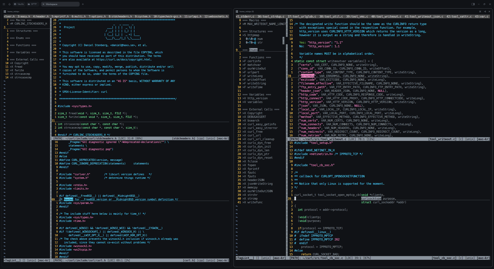

# air-gapped-dotfiles

## 왜?

폐쇄망 환경(ex - 증권사에서 제공하는 DMA) 내에서 개발을 해야 하는 경우  
순수한 vim과 ctag 같은 기본적인 도구만으로 개발을 해야 하는 상황이 있음.  
특히, DMA 라면 vscode 등 IDE가 원격 접속하기 위해 생성된 프로세스 마저도
latency에 기여하여 매매에 영향을 미치기도 한다.

When developing in an air-gapped environment (e.g., DMA provided by securities firms),
there are situations where development must be done using only vim and gcc.
Specifically, in DMA environments, even the processes created by VSCode's remote access
can contribute to latency that may affect trading performance.

### vim work view

 - [ ] \<Leader\>tl: Generate tagbar using ctags for current buffer
 - [ ] Show buffer list at the top
 - [ ] Split horizontally and navigate windows using Termius (if Termius is not allowed, use tmux)

